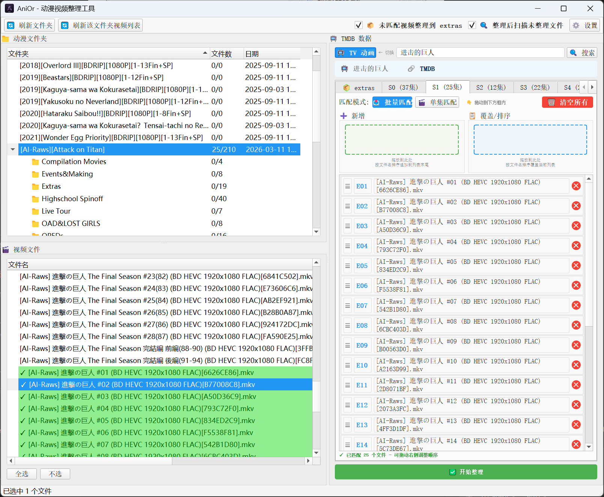
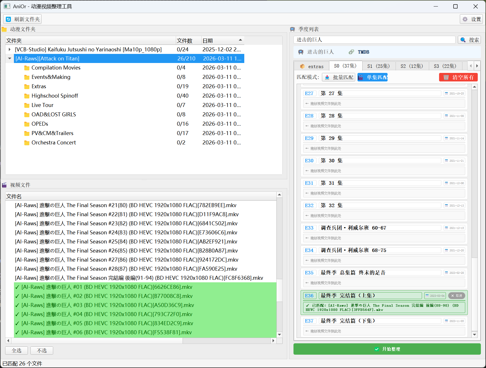

# AniOr - 动漫视频整理工具

通过 GUI 拖放操作，将动漫视频文件整理到对应季度目录。

## 项目背景

写这个工具的原因是：动漫组资源的命名非常复杂，还有各种 SP、特典等额外内容。尝试过自动整理工具，但发现它们很难准确自动整理番剧日漫。因此写了这个手动匹配整理工具，通过可视化的方式手动匹配每一集，确保整理准确无误。


## 功能特点

- 🔍 **TMDB 搜索**：搜索番剧并自动获取季度和集数信息
- 🖱️ **拖放匹配**：支持批量拖放和单集拖放两种模式
- 🔗 **多种模式**：硬链接（推荐）、剪切、复制
- 📊 **实时高亮**：已匹配文件自动绿色标注
- 📁 **子文件夹**：支持子文件夹折叠/展开
- ✅ **整理完成弹窗**：显示统计信息、失败日志和未处理文件
- 🎬 **未匹配文件处理**：可勾选未匹配文件整理到 extras 文件夹
- 📝 **自定义视频格式**：支持配置视频文件扩展名

## 安装与运行

### 方法一：下载可执行文件（推荐）

从 [Releases](https://github.com/mayziran/AniOr/releases) 页面下载最新的 `AniOr.exe`，双击即可运行。

### 方法二：源码运行

```bash
# 安装依赖
pip install -r requirements.txt

# 运行程序
python anior.py
```

## 使用说明

### 1. 首次配置

点击 ⚙️ 设置，配置以下选项：

| 设置项 | 说明 | 必填 |
|--------|------|------|
| **源目录** | 动漫视频所在的文件夹 | ✅ |
| **目标目录** | 整理后输出的文件夹 | ✅ |
| **TMDB API Key** | 从 [TMDB](https://www.themoviedb.org/settings/api) 申请 | ✅ |
| **整理模式** | 硬链接（推荐）/剪切/复制 | ✅ |
| **视频格式** | 支持的视频扩展名，逗号或空格分隔 | 可选（默认 13 种） |
| **未匹配文件** | 开启后自动将未匹配视频移到 extras 文件夹 | 可选（默认开启） |
| **extras 忽略** | 在 extras 文件夹生成.embyignore 文件 | 可选（默认开启） |

### 2. 搜索番剧

在右侧搜索框输入番剧名称（如"进击的巨人"），点击 🔍 搜索并选择。

### 3. 匹配文件

- **批量模式**：拖放多个文件到"新增"或"覆盖/排序"区域，自动按文件名排序
- **单集模式**：逐个拖放文件到对应集数行

### 4. 开始整理

点击 ✅ 开始整理，选择整理模式后确认。

整理完成后会弹出窗口显示：
- 📊 整理统计（成功/失败数量）
- 📝 失败日志（如有）
- 🎬 **未处理文件列表**（可勾选整理到 extras）

**未处理文件列表功能**：
- 显示源目录中所有未被整理的文件（包含所有格式）
- 🔴 **红色高亮** = 因重名导致整理失败的文件（置顶显示）
- 勾选文件后点击【确定】，会二次确认后按设置的整理模式移动到 extras 文件夹
- 字幕文件会自动跟随视频文件一起移动

## 输出结构

```
目标目录/
└── 番剧名 (年份)/
    ├── Season0/          # OVA/特典
    │   └── S00E01 - 原名.mkv
    ├── Season1/          # 第一季
    │   └── S01E01 - 原名.mkv
    └── Season2/          # 第二季
        └── S02E01 - 原名.mkv
```

## 支持的视频格式

**默认支持 13 种格式**：
`.mp4`, `.mkv`, `.avi`, `.wmv`, `.flv`, `.webm`, `.m4v`, `.mov`, `.ts`, `.mpg`, `.mpeg`, `.rm`, `.rmvb`

可在设置中自定义。

## 支持的字幕格式

`.srt`, `.ass`, `.ssa`, `.sub`, `.idx`, `.vtt`

字幕文件会自动跟随视频文件移动到对应目录。

## 整理模式

| 模式 | 说明 | 适用场景 |
|------|------|---------|
| **硬链接** (link) | 创建硬链接，不占用额外空间，源文件保留 | 本地媒体库（推荐） |
| **剪切** (cut) | 移动文件到目标目录，删除源文件 | 整理后清理源目录 |
| **复制** (copy) | 复制文件到目标目录，保留源文件 | 备份或保留源文件 |

## 高级功能

### auto_extras（未匹配文件自动整理）

开启后，程序会自动扫描源目录中未被匹配的剩余文件，并在整理完成后提示你是否要将它们移动到 extras 文件夹。

适用场景：
- 动漫文件夹中有特典、NCOP、NCED 等额外视频
- 希望自动整理所有相关文件

### embyignore_extras

在 extras 文件夹中生成 `.embyignore` 文件，让 Emby/Plex 等媒体服务器忽略该文件夹，避免显示混乱。

### 同名文件保护

如果目标文件已存在，程序会报错并跳过，不会覆盖原有文件。失败的文件会在整理完成弹窗中红色高亮显示。

## 截图

### 主界面





## 许可证

MIT License - 详见 [LICENSE](LICENSE) 文件
